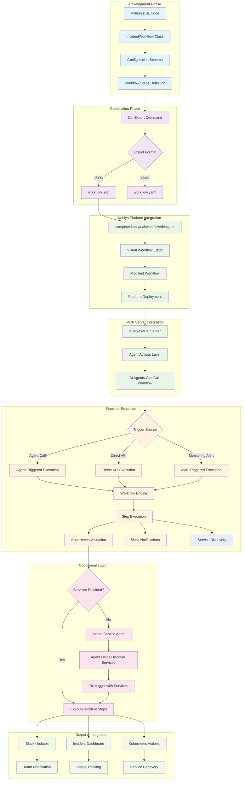
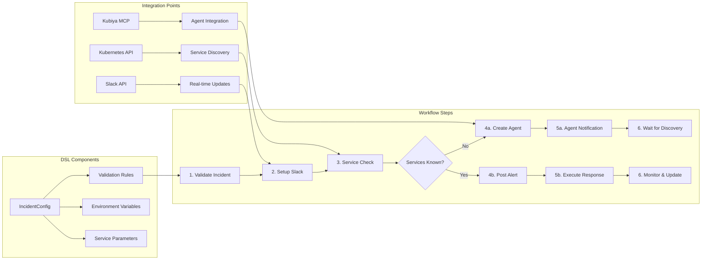
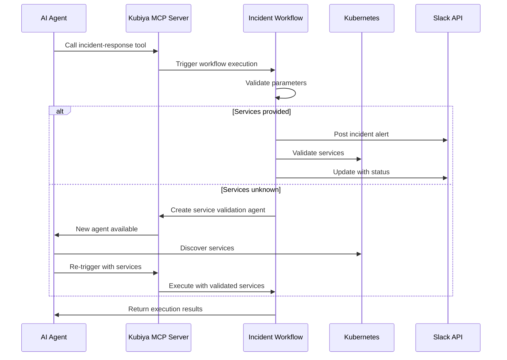
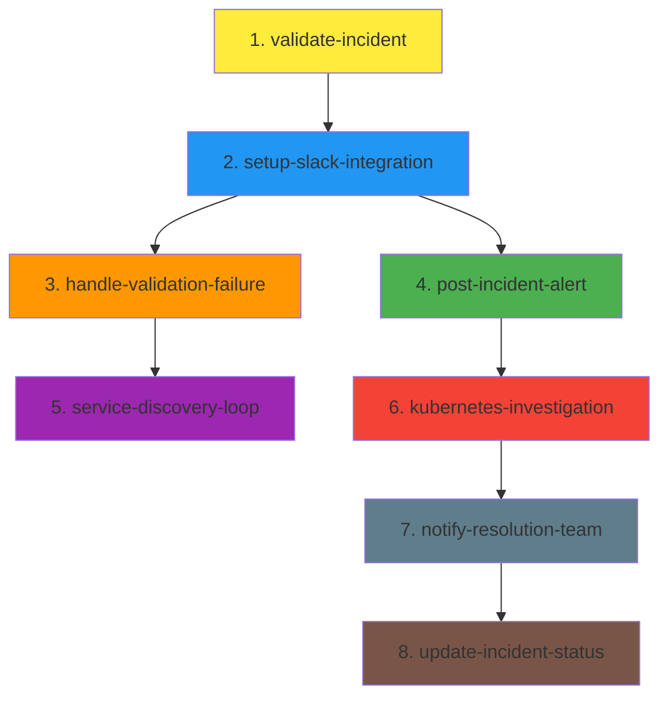

# Kubiya Incident Response Workflow

Production-grade incident response workflow with intelligent service validation for Kubernetes environments.

## 🔄 End-to-End Workflow Architecture



## 🏗️ Workflow Components Architecture



## 🚀 Quick Start

### 1. Setup

```bash
# Setup environment
./setup.sh

# Or for development
./dev-setup.sh
```

### 2. Export Workflow

```bash
# Activate environment
source venv/bin/activate

# Export to JSON for Kubiya CLI
python -m kubiya_incident.cli export --format json --output incident-workflow.json

# Export with custom parameters
python -m kubiya_incident.cli export \
  --format json \
  --incident-id "PROD-TEMPLATE" \
  --title "Production Incident" \
  --severity critical \
  --output prod-incident.json
```

### 3. Kubiya Platform Integration

#### Visual Workflow Designer

1. **Export your workflow:**
   ```bash
   python -m kubiya_incident.cli export --format json --output incident-workflow.json
   ```

2. **Import to Workflow Designer:**
   - Navigate to [compose.kubiya.ai/workflow/designer](https://compose.kubiya.ai/workflow/designer)
   - Click "Import" or "Load JSON"
   - Upload your `incident-workflow.json` file
   - Modify steps visually using the drag-and-drop interface
   - Add/remove steps, modify parameters, change conditions
   - Export modified workflow back to JSON/YAML

3. **Deploy to Platform:**
   - Use the platform's deployment features
   - Configure triggers (webhooks, schedules, agent calls)
   - Set up environment variables and secrets
   - Enable MCP server integration for agent access

#### MCP Server Integration



### 4. Use with Kubiya CLI

#### Install Kubiya CLI

**Debian/Ubuntu:**
```bash
curl -fsSL https://cli.kubiya.ai/apt-key.gpg | sudo gpg --dearmor -o /usr/share/keyrings/kubiya-archive-keyring.gpg
echo "deb [signed-by=/usr/share/keyrings/kubiya-archive-keyring.gpg] https://cli.kubiya.ai/apt stable main" | sudo tee /etc/apt/sources.list.d/kubiya.list
sudo apt update
sudo apt install kubiya-cli
```

**From Source:**
```bash
git clone https://github.com/kubiyabot/cli.git
cd cli
make build
make install
```

#### Execute Workflow

```bash
# Set API key
export KUBIYA_API_KEY="your-api-key"

# Execute workflow (replace with actual execution method)
kubiya tool execute incident-response \
  --incident-id "INC-$(date +%Y%m%d-%H%M%S)" \
  --title "Database Connection Failure" \
  --severity "high" \
  --services "user-api,payment-service"
```

## 📋 CLI Commands

### Export Commands
```bash
# Basic export
python -m kubiya_incident.cli export --format json

# Export to file
python -m kubiya_incident.cli export --format yaml --output workflow.yaml

# Custom parameters
python -m kubiya_incident.cli export \
  --incident-id "INC-123" \
  --title "Custom Incident" \
  --severity high \
  --format json
```

### Validation
```bash
# Validate configuration
python -m kubiya_incident.cli validate \
  --incident-id "TEST-123" \
  --title "Test Incident" \
  --severity medium
```

### Service Agent Creation
```bash
# Create service validation agent
python -m kubiya_incident.cli create-agent \
  --incident-id "SERVICE-001" \
  --title "Service Discovery" \
  --severity high \
  --output agent.json
```

## 🔧 Workflow Customization

### Modifying Workflow Steps

The workflow consists of 8 main steps that can be customized:



### Customization Points

1. **Parameter Validation** (`validate-incident`):
   - Modify required fields in `core/config.py`
   - Add custom validation rules
   - Change severity levels

2. **Slack Integration** (`setup-slack-integration`):
   - Customize notification templates
   - Add different channels for different severities
   - Modify message formatting

3. **Service Discovery Logic** (`handle-validation-failure`):
   - Customize agent creation parameters
   - Modify service discovery tools
   - Add custom Kubernetes queries

4. **Alert Formatting** (`post-incident-alert`):
   - Design custom Slack block layouts
   - Add rich notifications
   - Include dashboard links

### Example: Adding Custom Step

```python
# In workflows/incident_response.py
def _create_custom_monitoring_step(self) -> Dict[str, Any]:
    return {
        "name": "setup-monitoring-alerts",
        "description": "Configure monitoring for incident tracking",
        "command": """
            # Custom monitoring setup
            echo "Setting up monitoring for incident ${incident_id}"
            # Add your monitoring logic here
        """,
        "executor": {"type": "command", "config": {}},
        "depends": ["validate-incident"],
        "output": "monitoring_status"
    }
```

## 🏗️ Workflow Features

- **🔄 Automated Incident Response**: Complete incident management workflow
- **🤖 Service Validation**: AI agent for Kubernetes service discovery
- **💬 Slack Integration**: Real-time notifications and updates
- **📊 Multiple Formats**: Export to JSON/YAML
- **🎯 Conditional Logic**: Smart service validation vs. agent creation
- **🔧 Highly Customizable**: Modify steps, add custom logic, change integrations

## 🐳 Docker

```bash
# Build container
./docker-build.sh

# Run with Docker
docker run --rm \
  -e KUBIYA_API_KEY="your-key" \
  kubiya-incident-response:latest \
  python -m kubiya_incident.cli export --format json
```

## 🔧 Development

```bash
# Setup dev environment with testing tools
./dev-setup.sh

# Format code
./format.sh

# Run lints
./lint.sh

# Run tests
./test.sh
```

## 📁 Generated Files

- `examples/workflow-basic.json` - Basic incident workflow
- `examples/workflow-critical.json` - Critical incident template  
- `examples/service-validation-agent.json` - Service validation agent config

### JSON Structure for Workflow Designer

The exported JSON follows the Kubiya Workflow SDK format:

```json
{
  "name": "production-incident-workflow",
  "description": "Automated incident response with service validation",
  "params": {
    "incident_id": "INC-123",
    "incident_title": "Incident Title",
    "incident_severity": "high",
    "affected_services": "service1,service2"
  },
  "steps": [
    {
      "name": "validate-incident",
      "description": "Validate incident parameters",
      "executor": {"type": "command", "config": {}},
      "command": "# Validation logic here",
      "output": "validation_status"
    }
  ]
}
```

**Key Components for Designer:**
- `name`: Workflow identifier
- `description`: Human-readable description
- `params`: Input parameters with default values
- `steps`: Array of executable steps with dependencies
- `executor`: Execution environment configuration

## 🎯 Integration

This workflow is designed to be triggered by monitoring systems and integrates with:
- Kubernetes clusters for service validation
- Slack for real-time communication
- Kubiya platform for workflow execution

## 📝 Configuration

Required environment variables:
- `KUBIYA_API_KEY` - For workflow execution (optional for export)

Optional:
- `KUBIYA_USER_EMAIL` - Default incident owner
- `SLACK_CHANNEL_ID` - Default notification channel

## 🔗 Links

- [Kubiya CLI Repository](https://github.com/kubiyabot/cli)
- [Kubiya Workflow SDK](https://github.com/kubiyabot/workflow-sdk)